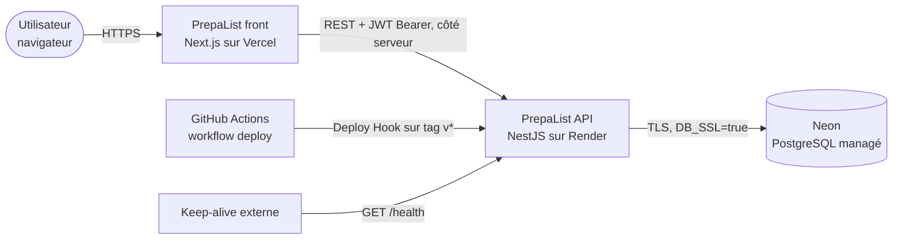
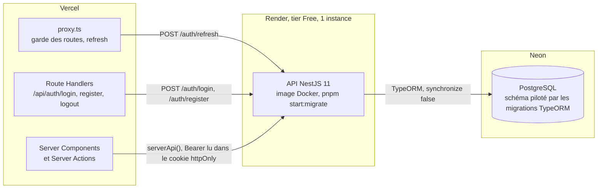
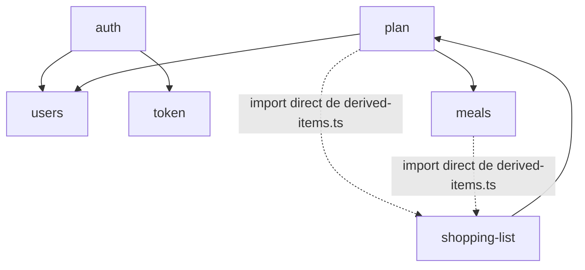

# Architecture

Point d'entrée de la doc : [modèle de données](data-model.md), [flux](flows.md),
[glossaire](glossary.md), [décisions (ADR)](adr/).

## Contexte (C4 niveau 1)

- Le navigateur ne parle jamais à l'API : le front l'appelle depuis son serveur
  (Route Handlers, Server Components, Server Actions). D'où `CORS_ORIGINS` vide en
  production, qui n'autorise aucune origine (`resolveCorsOrigin`, `src/common/cors-origin.ts` ;
  `deploy/README.md`).
- Le keep-alive empêche Render Free de mettre le service en veille. Il ping
  `/health`, qui ne touche pas la base (voir [ADR 0007](adr/0007-health-liveness-sans-db.md)).

## Conteneurs (C4 niveau 2)

- Les tokens vivent dans des cookies httpOnly posés par le front ; le serveur Next
  relaie l'access token en `Authorization: Bearer` (`serverApi`, `prepalist_front/src/lib/api.ts`).
- Au démarrage sur Render, `pnpm start:migrate` joue les migrations compilées puis
  lance `node dist/main` (`package.json`, script `start:migrate`).

## Modules Nest

`AppModule` (`src/app.module.ts`) enregistre 7 modules ; `TokenModule`, le huitième,
n'est importé que par `AuthModule`. Trois guards globaux, dans cet ordre :
`ThrottlerGuard`, `JwtAuthGuard`, `RolesGuard` (`providers` de `AppModule`). Toute
route est authentifiée sauf celles marquées `@Public()`.

| Module | Rôle | Routes |
| --- | --- | --- |
| `health` | Liveness, sans base | `GET /health` (public) |
| `users` | Compte, jour de courses, promotion `ADMIN_EMAILS` au boot | `GET /users/me`, `PATCH /users/me` |
| `token` | Émission et vérification des JWT access et refresh | aucune |
| `auth` | Inscription, login, refresh, stratégie Passport JWT | `POST /auth/register`, `/auth/login`, `/auth/refresh` (publiques, 5 req/min) |
| `ingredients` | Catalogue d'ingrédients, unité par défaut, rayon | `GET /ingredients` ; `POST`, `PATCH` réservés `ADMIN` |
| `meals` | Catalogue de recettes, tags, note par compte | `GET /meals`, `/meals/tags`, `/meals/:id`, `PATCH /meals/:id/state` ; `POST`, `PATCH`, `DELETE` réservés `ADMIN` |
| `plan` | Plan unique par utilisateur, créneaux, génération | `GET /plan`, `POST /plan/generate`, `PATCH /plan/slots/:slotId`, `POST /plan/slots/:slotId/move`, `DELETE /plan/slots` |
| `shopping-list` | Liste de courses matérialisée | `GET /plan/shopping-list`, `POST .../sync`, CRUD `.../items` |

Flèches pleines : imports de modules Nest. Pointillés : `plan.service.ts` et
`meals.service.ts` importent les fonctions de `shopping-list/derived-items.ts`
sans passer par l'injection (`lockPlan`, `reconcileDerived`, `planIdsUsingMeal`,
`reconcilePlans`). C'est ce qui permet de réconcilier la
liste dans la transaction qui modifie le plan ou une recette.
