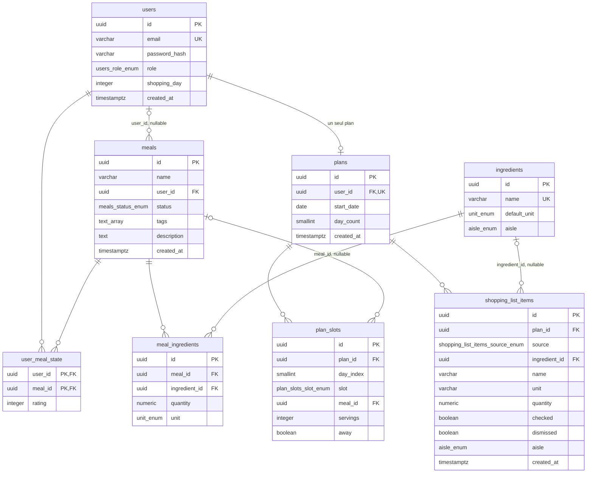

# Modèle de données

Schéma obtenu en rejouant `src/migrations/` dans l'ordre, jusqu'à
`1788100000000-AddAisles.ts`. Le schéma n'évolue que par migration
(`synchronize: false` dans `dataSourceOptions`, `src/config/data-source.ts`), et la CI échoue si les
entities divergent des migrations (étape « Schema drift », `.github/workflows/ci.yml`).

## ERD

`text_array` = `text[]`. TypeORM ajoute sa table de suivi `migrations`, hors du
modèle applicatif.

## Contraintes et index

| Table | Contrainte | Effet | Migration |
| --- | --- | --- | --- |
| `users` | `UQ_users_email` | email unique, normalisé en minuscules par l'applicatif | `1719792000000-InitUsers.ts:18` |
| `ingredients` | `UQ_ingredients_name_lower` | index unique sur `LOWER(name)` : « Tomate » et « tomate » ne coexistent pas | `1719801000000-IngredientNameCaseInsensitive.ts:17` |
| `meals` | `FK_meals_user` | `ON DELETE CASCADE` ; `user_id` NULL = recette de l'application | `1786000000000-MoveMealStateToUser.ts:22-24` |
| `meal_ingredients` | `FK_mi_meal`, `FK_mi_ingredient` | cascade depuis le repas ; aucune action depuis l'ingrédient (suppression refusée s'il sert) | `1719795000000-InitMealsIngredients.ts:45-48` |
| `user_meal_state` | `PK_user_meal_state` | clé composite `(user_id, meal_id)`, cascade des deux côtés | `1786000000000-MoveMealStateToUser.ts:47-51` |
| `plans` | `UQ_plans_user` | index unique sur `user_id` : un plan par compte | `1785400000000-ReplaceWeeksWithSingletonPlan.ts:36` |
| `plan_slots` | `UQ_plan_slots_plan_day_slot` | un créneau par `(plan_id, day_index, slot)` | `1785400000000-ReplaceWeeksWithSingletonPlan.ts:55` |
| `plan_slots` | `FK_plan_slots_meal` | `ON DELETE SET NULL` : supprimer un repas vide les créneaux | `1785400000000-ReplaceWeeksWithSingletonPlan.ts:53-54` |
| `plan_slots` | `CHK_plan_slots_away_empty` | `CHECK (NOT (away AND meal_id IS NOT NULL))` | `1788000000000-AddAwayToPlanSlots.ts:11` |
| `shopping_list_items` | `UQ_shopping_items_derived` | index unique partiel `(plan_id, ingredient_id, unit) WHERE source = 'DERIVED'` ; les tombstones `dismissed` occupent aussi leur clé | `1785400000000-ReplaceWeeksWithSingletonPlan.ts:87` |
| `shopping_list_items` | `FK_shopping_items_ingredient` | `ON DELETE CASCADE` | `1785400000000-ReplaceWeeksWithSingletonPlan.ts:76-77` |

## Types énumérés

| Type | Valeurs | Colonnes |
| --- | --- | --- |
| `users_role_enum` | `USER`, `ADMIN` | `users.role` |
| `meals_status_enum` | `PRIVATE`, `PENDING`, `PUBLISHED` | `meals.status` (`1786000000000-MoveMealStateToUser.ts:29-34`) ; exposé par les DTO, aucune logique ne filtre encore dessus |
| `unit_enum` | `g`, `ml`, `pièce`, `tranche`, `gousse`, `feuille`, `boîte`, `rouleau`, `boule`, `c.à.s`, `c.à.c` | `meal_ingredients.unit`, `ingredients.default_unit` |
| `aisle_enum` | `PRODUCE`, `BAKERY`, `MEAT_FISH`, `DAIRY`, `CHEESE_DELI`, `PANTRY_SAVORY`, `PANTRY_SWEET`, `FROZEN`, `DRINKS`, `HOUSEHOLD`, `OTHER` | `ingredients.aisle`, `shopping_list_items.aisle` |
| `plan_slots_slot_enum` | `LUNCH`, `DINNER` | `plan_slots.slot` |
| `shopping_list_items_source_enum` | `DERIVED`, `MANUAL` | `shopping_list_items.source` |

`shopping_list_items.unit` reste un `varchar` : un article manuel antérieur au jeu
d'unités fermé garde l'unité tapée (`1786500000000-CloseUnitSet.ts:7-8`).
Ajouter une valeur à `unit_enum` ou `aisle_enum` se fait par une migration écrite à
la main (`CLAUDE.md`, section « Règles de code »).

## Valeurs par défaut utiles

- `users.shopping_day` : `1` (lundi), 0 = dimanche … 6 = samedi.
- `plans.day_count` : `7` ; `plan_slots.servings` : `1` ; `plan_slots.away` : `false`.
- `shopping_list_items.checked` et `dismissed` : `false`.
- `meals.status` : défaut de colonne `PRIVATE`, mais `MealsService.create` écrit
  `PUBLISHED` ; les recettes existantes au moment de la migration ont été passées en
  `PUBLISHED`.

## Ce qui a disparu

- `weeks`, `week_slots` et leur enum : remplacés par `plans` / `plan_slots`, données
  perdues (`1785400000000-ReplaceWeeksWithSingletonPlan.ts`).
- Sur `meals` : `is_favorite`, `rating`, `last_cooked_at`, `times_cooked`, déplacés
  vers `user_meal_state` (`1786000000000`).
- Sur `user_meal_state` : `is_favorite` (`1787700000000`), puis `last_cooked_at` et
  `times_cooked` (`1787800000000`). Il ne reste que `rating`.
