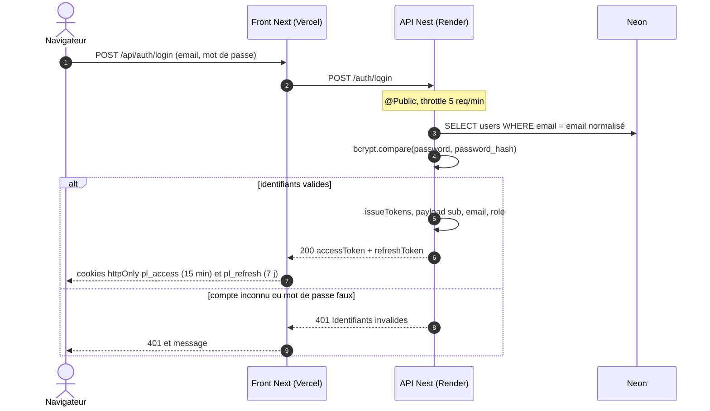
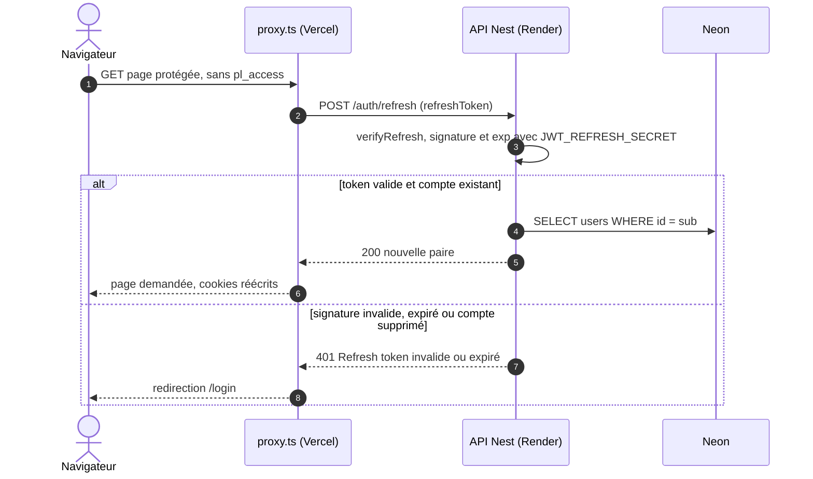
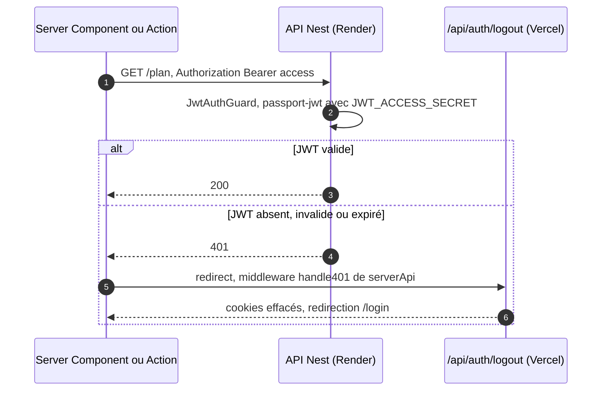
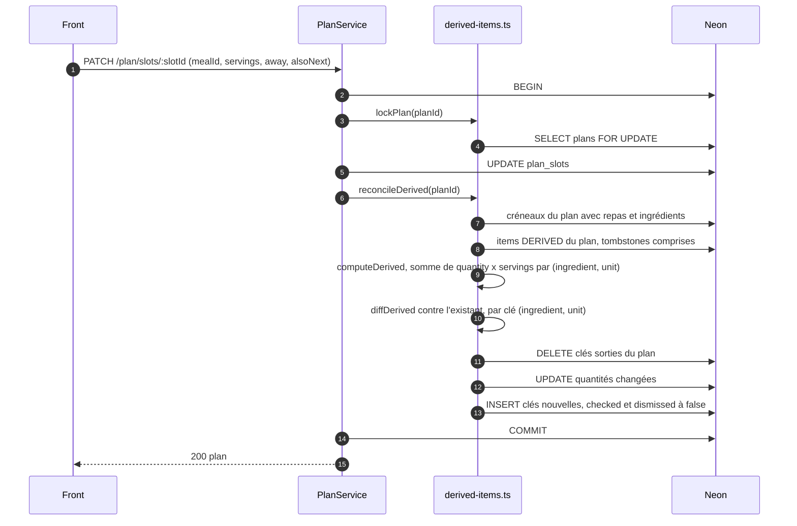
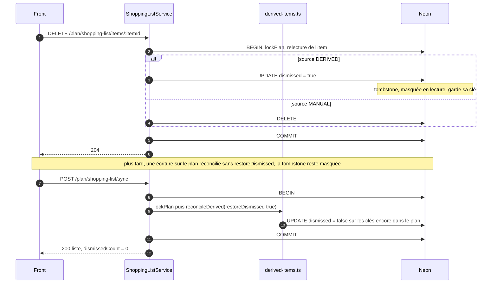
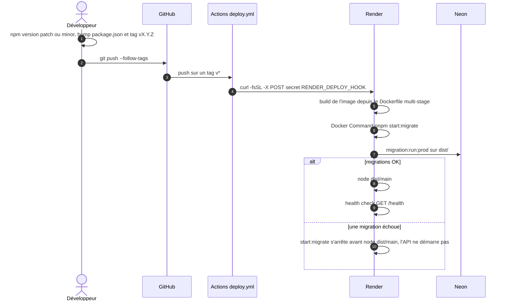

# Flux

## Auth

Access token 15 min, refresh token 7 jours, signés avec deux secrets distincts
(`src/modules/token/token.service.ts:30-39`). Le refresh n'est pas stocké en base
([ADR 0003](adr/0003-refresh-token-stateless.md)). Côté front, la durée de vie des
cookies suit celle des JWT : le proxy considère qu'un cookie access présent est
valide (`prepalist_front/src/lib/cookies.ts`).

### Login

### Refresh

Déclenché par `proxy.ts` quand le cookie access a expiré mais que le refresh est
encore là.

Le compte est relu à chaque refresh (`src/modules/auth/auth.service.ts:40-45`) :
le rôle porté par le nouveau JWT est celui de la base, d'où la promotion
`ADMIN_EMAILS` visible au refresh suivant.

### 401 sur un appel métier

L'API ne relit pas le compte sur une requête authentifiée : `JwtStrategy.validate`
recopie le payload (`src/modules/auth/strategies/jwt.strategy.ts:19-21`). Un compte
supprimé passe donc le guard tant que son access token n'a pas expiré.

## Plan vers liste de courses

Les items `DERIVED` sont recalculés depuis les créneaux dans la transaction qui
modifie le plan, sous un verrou `SELECT ... FOR UPDATE` sur la ligne `plans`
(`lockPlan`, `src/modules/shopping-list/derived-items.ts:102-111`). Écrivent sous
ce verrou : `generate`, `updateSlot`, `moveSlot`, `clearSlots`
(`src/modules/plan/plan.service.ts`), la modification et la suppression d'une
recette (`src/modules/meals/meals.service.ts:135-158`), et toute écriture sur un
item de la liste.

### Réconciliation après une écriture sur le plan

Règles de `diffDerived` (`src/modules/shopping-list/derived-items.ts:59-99`) :

- une coche survit, sauf si la quantité augmente sur un item coché : il est alors
  décoché et, s'il était `dismissed`, il revient dans la liste ;
- le nom n'est jamais réécrit, il a pu être édité à la main ;
- les items `MANUAL` ne sont jamais lus ni touchés.

`moveSlot` prend le verrou mais ne réconcilie pas : mêmes repas, mêmes portions
(`src/modules/plan/plan.service.ts:290-291`). `clearSlots` supprime tous les
`DERIVED`, tombstones comprises, et garde les `MANUAL`
(`src/modules/plan/plan.service.ts:306-318`).

### Suppression d'un item, tombstone et /sync

La lecture (`GET /plan/shopping-list`) filtre `dismissed = false` et renvoie
`dismissedCount`, ce qui permet au front de proposer le `/sync`
(`src/modules/shopping-list/shopping-list.service.ts:210-233`). La suppression
multiple et le vidage suivent la même règle : tombstone pour un `DERIVED`, suppression
pour un `MANUAL` (`src/modules/shopping-list/shopping-list.service.ts:61-87`).

## Déploiement

- L'auto-deploy natif de Render est désactivé : seul un tag déploie
  (`.github/workflows/deploy.yml:3-6`).
- Le champ Docker Command de Render ne passe pas par un shell, d'où le script
  `start:migrate` qui porte le `&&` (`deploy/README.md`, section Render).
- Le commentaire de `deploy.yml` parle encore d'une Pre-Deploy Command : elle est
  payante et vide sur le tier Free, les migrations passent par `start:migrate`.
- Le front suit le même schéma avec un Deploy Hook Vercel, dans son propre dépôt.
